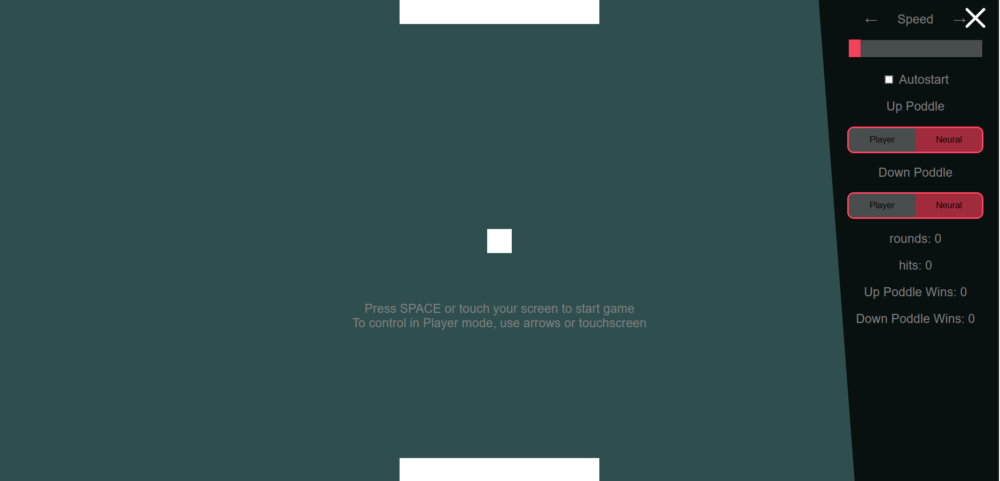

Simple Pong with neural network learning mechanism, written in js ES6 standard. 
Makes possibility to see how fast neural network can learn simple things - just like playing a pong

Avialiable at: neural.ct8.pl

You can find the network code in src/NN.js, the rest of code is GUI and game-mechanisms

Used libraries:
- synaptic.js
- react.js
